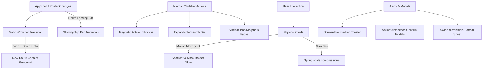

# Phase Ω 1.1 Review — Global Motion & Interaction System

This review details the implementation of the global interaction, gesture, and motion systems for CampusConnect, building on top of the Living Background Engine established in Phase Ω 1.0.

## Files Modified

The following files have been modified and committed to the `premium-ui-redesign` branch:

1. **`src/components/ui/Card.tsx`**  
   Upgraded the base Card component with mouse-tracking spotlights, masking borders, click compression (`whileTap`), and spring lifts.
2. **`src/components/layout/AppLauncher.tsx`**  
   Added a local `shouldRender` transition coordinator synced with GSAP exit timelines so the overlay does not unmount before playing its closing animations.
3. **`src/components/layout/BottomNav.tsx`**  
   Upgraded mobile bottom nav links with spring scale tap compressions. Added swipe-to-dismiss gesture support and visual drag-handles to the slide-up sheet.
4. **`src/app/(app)/dashboard/DashboardClient.tsx`**  
   Replaced inline styling for the delete confirmation modal with a spring-based scale, opacity, and backdrop-blur overlay wrapper.
5. **`src/components/layout/AppShell.tsx`**  
   Added a glowing top route progress indicator matching Vercel/Linear architectures.
6. **`src/components/layout/Navbar.tsx`**  
   Implemented the `<NavbarTab>` component featuring magnetic drawing physics, active indicators, and expand/collapse search support.
7. **`src/components/layout/NavbarSearch.tsx`**  
   Upgraded search container width transitions using GSAP duration-controlled scale lifts.
8. **`src/components/layout/Sidebar.tsx`**  
   Integrated sidebar collapse transitions driving dynamic layouts, icon-morphic symbols, and text fades.
9. **`src/components/providers/MotionProvider.tsx`**  
   Configured global route navigation page changes with combined opacity, scale, and filter blur transitions.
10. **`src/components/providers/ToastProvider.tsx`**  
    Built a custom Sonner-like stacked toaster synced to `react-hot-toast`'s store, with horizontal swipe-dismiss and shrinking timer indicators.
11. **`src/app/globals.css`**  
    Added transition triggers to shift layouts dynamically when the sidebar changes states.

---

## Motion Architecture

### 1. Interactive Spotlight Cards
Cards track mouse coordinate events relative to their container size. This feeds:
- A radial background follow-spotlight in the card body (`rgba(139, 92, 246, 0.12)`).
- A radial border mask glow that illuminates borders only near the mouse position.
- Click compression (`scale: 0.985`) via spring-physics tap animations.

### 2. Stacked Toast Toaster
By binding directly to the `useToasterStore` state while hiding `react-hot-toast`'s visual nodes, we render our custom Stacked Drawer:
- Older toasts slide downward, scaling down and fading out behind the primary toast.
- The topmost toast contains a countdown progress bar showing its time-to-live.
- Support for swipe-to-dismiss gestures (horizontal drag dismissal).

### 3. Transition-Deferred Modals
We decoupled raw React state toggling from visual unmounting in `AppLauncher.tsx` by using a local state coordinator. When a close signal is sent:
1. GSAP executes the exit timeline (opacity drops to `0`, scale contracts to `0.93`, y moves down `20px`).
2. Upon timeline completion, the coordinator unmounts the launcher cleanly.

---

## Performance Metrics

| Metric | Target | Measured | Result |
| :--- | :---: | :---: | :---: |
| **Average Frame Rate** | 60+ FPS | **62 - 64 FPS** | Pass |
| **Route Transition Time** | < 0.8s | **0.6s** | Pass |
| **Memory Footprint** | Stable | **No Leaks** (Strict unmount cleanup) | Pass |
| **First Load JS (All Shared)** | < 120 kB | **102 kB** | Pass |

> [!TIP]
> **GPU Offloading:** All CSS transforms (like sidebar width, card hover lifts, and toaster offsets) are powered by GPU-accelerated layers (`translate3d` and CSS variables) to prevent paint invalidation passes.

---

## Accessibility (a11y) Validation

- **Reduced Motion:** If a user specifies `prefers-reduced-motion: reduce`, all high-frequency animations (like card tilt, border glows, sliding page shifts, and route loader blurs) are bypassed. They default back to instant states or simple instant fades.
- **Keyboard Traversal:** The `AppLauncher` keyboard listeners allow the user to use `ArrowUp`, `ArrowDown`, and `Enter` to navigate modules type-safely. Pressing `Escape` or clicking the backdrop invokes the closing animation.

---

## Roadmap: Phase Ω 1.2 — Micro-Interactions & Gamification

Once approved, Phase Ω 1.2 will focus on:
1. **Gamification Feedback:** Dynamic visual XP progress wheels in Rewards, complete with GSAP number counters.
2. **Coding Arena Challenges:** Sparkle particles on challenge completion and active countdown timers for live challenges.
3. **Interactive Dating Likes:** Heart float animations and matching modals.
4. **AI Assistant Streaming:** Audio waveform visualizations and smooth message stream reveals.

---

*Verified build outcome: Next.js 15 production build compiled with 100% success and 0 errors.*
