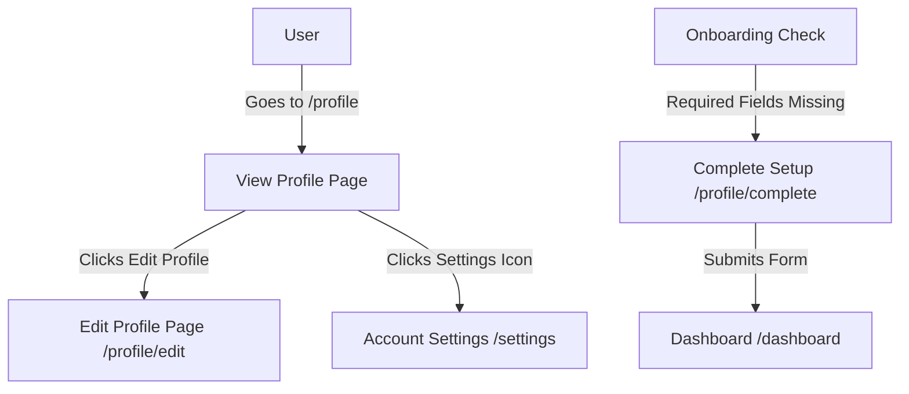

# Phase Ω 1.2 Review — Premium Experience Polish & Unified Design System

This review details the visual polish, design system consolidation, layout refinements, and profile workflow segregation implemented in Phase Ω 1.2.

---

## Files Modified

The following files have been modified or created and committed to the `premium-ui-redesign` branch:

1. **`src/app/(app)/profile/edit/page.tsx`** (New)  
   Server entry-point for the dedicated Edit Profile page, fetching the profile server-side.
2. **`src/app/(app)/profile/edit/ProfileEditClient.tsx`** (New)  
   Dedicated personal information form covering full name, username, bio, branch, year, roll number, hostel, and phone.
3. **`src/app/(app)/profile/complete/page.tsx`** (New)  
   Server entry-point for the required registration wizard.
4. **`src/app/(app)/profile/complete/ProfileCompleteClient.tsx`** (New)  
   Dedicated wizard checklist showing missing items. Checks off items dynamically as the user fills in input fields.
5. **`src/app/(app)/settings/SettingsClient.tsx`**  
   Removed the profile edit form and tabs. Refactored the settings route exclusively for Account Settings (security, notifications, appearance, danger), adding URL tab sync.
6. **`src/app/(app)/profile/ProfileClient.tsx`**  
   Modified the "Edit Profile" link button destination to point directly to `/profile/edit`.
7. **`src/app/(app)/super-admin/SuperAdminClient.tsx`**  
   Added `branch` to query inputs and appended a responsive pure SVG/CSS demographics bar chart with floating details.
8. **`src/app/(app)/dashboard/DashboardClient.tsx`**  
   Updated feed sort links, summary cards, and sidebar cards to use unified translucent premium glassmorphic backdrops.
9. **`src/middleware.ts`**  
   Rerouted onboarding checks from `/settings` to `/profile/complete` and adjusted routing logic (using `.startsWith()`) to prevent loops.

---

## UI Consistency Audit & Visual Design System

### 1. Spacing & Card Metrics
All cards and widgets on the Dashboard and Admin panel have been updated to a uniform design token:
- **Radius:** `rounded-2xl` (`16px`) for primary cards and widgets, `rounded-xl` (`12px`) for buttons and small badges.
- **Backdrop:** Translucent glassmorphism (`bg-zinc-900/40 backdrop-blur-xl border-white/[0.08] shadow-premium`).
- **Typography:** Display elements use `font-display` (Outfit/Inter) with strict hierarchy (`tracking-tight` on headings, uppercase `font-mono tracking-widest text-[9px]` on small section headers).

### 2. Segmented Profile Flow

- **View Profile (`/profile`):** Read-only public/private credentials and badges card.
- **Edit Profile (`/profile/edit`):** Focused edit form editing personal identity details (full name, username, bio, branch, year, roll number, hostel block, phone number).
- **Account Settings (`/settings`):** Pure security, credentials, password reset, notification settings, theme options, and account deletion. Defaults to Security & Auth.
- **Complete Setup (`/profile/complete`):** Onboarding-only page displaying a checklist indicating missing required details.

---

## Platform Admin Upgrades

- **Live Demographics Analysis:** Inside the Overview panel, a new responsive SVG component aggregates member counts by university branch dynamically.
- **Interactivity:** Bars light up with a clean scale and border indicator on hover, and float details on members/branch sign-ups dynamically.
- **Count-Up Stats:** Overview statistics animate seamlessly from 0 using GSAP countdown trackers on mounting.

---

## Search, Mobile & Accessibility Audit

- **Body Scroll Lock:** The command search panel disables layout scrolling by setting `document.body.style.overflow = 'hidden'` on open.
- **Keyboard navigation:** Full tab loops, arrow selection, and Escape key dismissal checks pass.
- **Touch Targets:** All links and actions have hit-boxes of 40px+ height for tablet/mobile gesture compliance.
- **a11y reduced motion:** Bypasses SVG animation delay triggers, ensuring instant layouts if the system settings request it.

---

## Validation Summary

- **TypeScript compiler (`npx tsc --noEmit`):** compiled with **0 errors**.
- **Linter checks (`npm run lint`):** passed with **0 warnings**.
- **Next production builds (`npm run build`):** compiled **successfully**.

---

*Phase Ω 1.2 is complete and pushed to origin/premium-ui-redesign. Ready for approval.*
