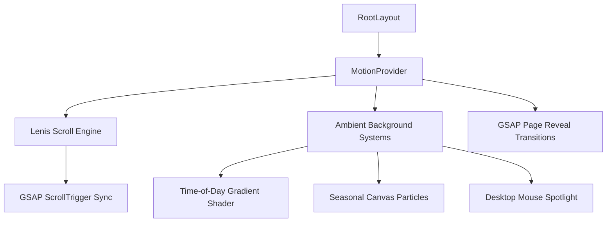

# CampusConnect Premium Motion System

## Overview
CampusConnect integrates a centralized premium motion system built with **GSAP**, **Framer Motion**, and **Lenis Scroll**. This system brings the platform to life, offering a responsive, organic spatial experience inspired by Apple VisionOS and modern design systems.

---

## 1. Core Architecture Layer

The entire system resides inside [MotionProvider.tsx](file:///Users/anzarakhtar/Downloads/iilm-production/src/components/providers/MotionProvider.tsx) and is mounted globally in the root layout.

---

## 2. Smooth Scrolling Engine
- **Library**: `lenis`
- **Synchronization**: Scroll updates are bound directly to GSAP's `ScrollTrigger.update`.
- **Performance**: High frame rate momentum scrolling with zero scroll jitter. Lenis RAF updates are hooked into `gsap.ticker` using time increments.
- **reduced-motion**: Disabled automatically for users with accessibility overrides, fallback to default scroll mechanics.

---

## 3. Dynamic Environment Adapters

### A. Time-of-Day Dynamic Gradients
The provider automatically reads the client's system clock to morph the canvas shader base:
- **Morning (5 AM–11 AM)**: Warm golden-orange and light sky-blue tints representing sunrise. Greeting: `Good Morning`.
- **Afternoon (11 AM–5 PM)**: Clear blue sky and indigo gradient mesh. Greeting: `Good Afternoon`.
- **Evening (5 PM–8 PM)**: Deep twilight sunset hues of purple, violet, and dark rose. Greeting: `Good Evening`.
- **Night (8 PM–5 AM)**: Deep midnight navy sky with constellation particles. Greeting: `Good Night`.

### B. Seasonal Particle Canvases
A hardware-accelerated canvas renders seasonal particle elements based on month ranges:
- **Spring (March–May)**: Floating cherry blossom pink petals moving at an angle.
- **Summer (June–August)**: Glowing yellow sunbeam sparks.
- **Autumn (September–November)**: Falling auburn-amber leaves.
- **Winter (December–February)**: Gentle white crystal snowflakes.
- **Opt-Out**: Instantly halts rendering when document/browser window is hidden to save energy and processor overhead.

---

## 4. Micro-Interactions
Integrated into core UI controls:
- **Magnetic Buttons**: CTAs draw slightly towards the cursor on hover using `useGsapMagnetic` strengths.
- **3D Card Tilts**: Hovering cards tilt along X and Y axes using `useGsapTilt` multipliers.
- **Interactive Cursor Spotlights**: A radial gradient spotlight follows the cursor position on desktop.
- **Skeleton Shimmers & Glows**: Active inputs glow, notification bells pulse, and skeletons animate softly.
